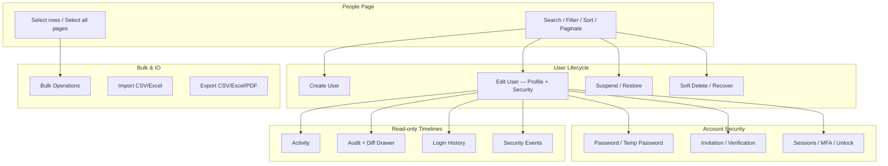

# People Module — Production Reference (v1.0.0)

**Status:** Frozen for production  
**Version:** `people-module@1.0.0`  
**Path:** `src/super-admin/people/`  
**Last hardened:** Sprint 02.10

---

## Overview

The People module is the Super Admin user lifecycle surface: list/search users, create and edit profiles, suspend/restore, soft delete/recover, account security (password, invitation, verification, sessions, MFA), bulk operations, import/export, and read-only timelines (activity, audit, login history, security events).

All privileged mutations run through **Supabase Edge Functions** with enterprise middleware (auth, RBAC, rate limiting, idempotency, audit, activity, request context). Read paths use React Query with cursor pagination where applicable.

---

## Workflow Map



---

## Repository Map

| Area | Path | Responsibility |
|------|------|----------------|
| Page shell | `pages/PeoplePage.tsx` | Orchestrates toolbar, table, drawers, dialogs |
| Components | `components/` | Table, toolbar, filters, stats, drawer shell |
| Create user | `create-user/` | Form, drawer, edge `create-user` |
| Edit user | `edit-user/` | Profile form, avatar, roles, edge `update-user` |
| Account security | `account-security/` | Security tab, snapshot, security edge functions |
| Suspend / restore | `suspend-restore/` | Dialogs, edge `suspend-user` / `restore-user` |
| Delete / recover | `delete-recover/` | Soft delete dialogs, edge `delete-user` / `recover-user` |
| Bulk ops | `bulk-operations/` | Selection UX, progress, edge `bulk-users` |
| Import / export | `import-export/` | File parsing, edge `import-users` / `export-users` |
| Timelines | `timeline/`, `activity/`, `audit/`, `login-history/`, `security-events/` | Infinite scroll panels, export |
| Data layer | `repositories/people.repository.ts` | Supabase reads (RLS) |
| Service layer | `services/people.service.ts` | Validation, error mapping |
| Hooks | `hooks/` | React Query keys, invalidation hub |
| Shared UI | `src/components/shared/timeline/` | Grouped timeline, diff drawer, infinite list |

### Legacy (do not use for new work)

| Path | Notes |
|------|-------|
| `src/super-admin/services/peopleService.ts` | Pre-module stub; not wired to production People page |
| `src/super-admin/stores/peopleStore.ts` | Legacy store |
| `src/super-admin/components/people/PeopleManagementPanel.tsx` | Placeholder panel |

---

## Service Map

| Frontend service | Edge function(s) | Mutations |
|------------------|-------------------|-----------|
| `create-user.service.ts` | `create-user` | Create auth user + profile |
| `edit-user.service.ts` | `update-user`, `upload-avatar`, `delete-avatar` | Profile, roles, avatar |
| `account-security.service.ts` | `reset-password`, `manage-invitation`, `manage-sessions`, `manage-mfa`, `unlock-account` | Security actions |
| `suspend-restore.service.ts` | `suspend-user`, `restore-user` | Status changes |
| `delete-recover.service.ts` | `delete-user`, `recover-user` | Soft delete lifecycle |
| `bulk-operations.service.ts` | `bulk-users` | Bulk suspend, restore, delete, roles, etc. |
| `import-export.service.ts` | `import-users`, `export-users` | Bulk IO |
| `timeline.service.ts` | `audit-timeline`, `login-history`, `security-events` | Read-only lists + export |
| `activity` (direct RLS) | — | `activity_logs` via browser client |
| `people.service.ts` | — | List, stats, filters (repository) |

---

## Permission Matrix

| Action | Required role | Enforcement |
|--------|---------------|-------------|
| View People page | `super_admin` | Route + `canViewPeople()` |
| List / stats / filters | `super_admin` | RLS on `profiles` + admin policies |
| Create / edit / suspend / delete | `super_admin` | Edge `permission: super_admin` |
| Account security actions | `super_admin` | Edge + protected-account checks in `_shared/security/` |
| Bulk / import / export | `super_admin` | Edge |
| Timelines (audit, login, security) | `super_admin` | Edge read handlers |
| Activity timeline | `super_admin` | RLS `activity_logs_select_admin` |

Protected rules (edge): last super admin, self-lockout, protected accounts — see `_shared/security/account-security.ts` and `_shared/permissions/user-lifecycle.ts`.

---

## Database Schema (People-related)

### Core tables

- **`profiles`** — User identity, status, avatar metadata, soft delete (`deleted_at`)
- **`user_roles` / `roles`** — Role assignments
- **`user_security`** — Password lifecycle metadata (no plaintext passwords)
- **`audit_logs`** — Immutable audit trail with before/after state
- **`activity_logs`** — Human-readable activity feed

### Indexes (migration `020_enterprise_foundation`)

| Table | Index | Purpose |
|-------|-------|---------|
| `audit_logs` | `created_at DESC`, `actor_id`, `target`, `request_id`, `trace_id`, `correlation_id` | Timeline pagination & lookup |
| `activity_logs` | `created_at DESC`, `target`, `actor_id`, `activity_type` | Activity & aggregation |
| `user_security` | `user_id` (partial active) | Security snapshot reads |

### Cursor pagination

- **Audit / login / security:** Edge functions use `created_at` cursor (`lt` filter) + `limit+1` pattern
- **Activity:** Client service uses same cursor on `activity_logs.created_at`
- **People list:** Offset pagination via repository (page/pageSize)

### Soft delete consistency

- Delete sets `profiles.deleted_at`; recover clears it
- `user_security.deleted_at` mirrored in migration `021`
- List queries exclude deleted unless status filter = `deleted`

---

## Edge Functions (People)

| Function | Auth | Validation | Audit | Activity | Idempotency | Rate limit |
|----------|------|------------|-------|----------|-------------|------------|
| `create-user` | ✓ | `user-requests` | ✓ | ✓ | ✓ | ✓ |
| `update-user` | ✓ | ✓ | ✓ | ✓ | ✓ | ✓ |
| `suspend-user` | ✓ | ✓ | ✓ | ✓ | ✓ | ✓ |
| `restore-user` | ✓ | ✓ | ✓ | ✓ | ✓ | ✓ |
| `delete-user` | ✓ | ✓ | ✓ | ✓ | ✓ | ✓ |
| `recover-user` | ✓ | ✓ | ✓ | ✓ | ✓ | ✓ |
| `reset-password` | ✓ | `security-requests` | ✓ | ✓ | ✓ | ✓ |
| `manage-invitation` | ✓ | ✓ | ✓ | ✓ | ✓ | ✓ |
| `manage-sessions` | ✓ | ✓ | ✓ | ✓ | ✓ | ✓ |
| `manage-mfa` | ✓ | ✓ | ✓ | ✓ | ✓ | ✓ |
| `unlock-account` | ✓ | ✓ | ✓ | ✓ | ✓ | ✓ |
| `bulk-users` | ✓ | `bulk-requests` | ✓ | ✓ | ✓ | ✓ |
| `import-users` | ✓ | ✓ | ✓ | ✓ | ✓ | ✓ |
| `export-users` | ✓ | ✓ | — | — | ✓ | ✓ |
| `audit-timeline` | ✓ | `timeline-utils` | — | — | ✓ | ✓ |
| `login-history` | ✓ | ✓ | — | — | ✓ | ✓ |
| `security-events` | ✓ | ✓ | — | — | ✓ | ✓ |
| `upload-avatar` / `delete-avatar` | ✓ | ✓ | ✓ | ✓ | ✓ | ✓ |

Shared handler: `createEnterpriseHandler()` — request context, correlation IDs, structured logging, metrics, error mapping (no raw stack traces to client).

---

## React Query Invalidation

Central hub: `useInvalidatePeople()` in `hooks/usePeople.ts`

| Method | Invalidates |
|--------|-------------|
| `invalidateLists` | People table |
| `invalidateDetail` | Edit drawer detail |
| `invalidateTimelines` | Activity, audit, login history, security events |
| `invalidateSecurity` / `invalidateSessions` | Account security snapshot |
| `invalidateEverything` | Full module cache |

Mutations in account security, bulk ops, delete/recover, suspend/restore call timeline invalidation after success.

---

## Error Handling

- **Repository:** `PeopleRepositoryError` with codes → friendly messages via `mapPeopleErrorToMessage()`
- **Service:** `PeopleServiceError` wraps repository/unknown errors; never exposes raw Postgres messages in UI
- **Edge:** `mapEdgeFunctionInvokeError()` in mutation hooks
- **Domain-specific:** `*.errors.ts` per feature (bulk, suspend, delete, account security)

---

## Security & Masking

- Sensitive fields masked in timeline diff/metadata (`src/enterprise/timeline/mask-sensitive.ts` + edge `_shared/timeline/timeline-utils.ts`)
- Passwords, tokens, MFA secrets, API keys → `••••••••`
- All timeline panels are **read-only**

---

## Observability

- Edge: structured logger per function scope, `recordRequestMetric`, request/trace/correlation IDs in `RequestContext`
- Frontend timelines: `TimelineMetricsBar` (query time, records returned, cache hit/miss)
- People logger: `utils/people.logger.ts` (dev-only structured console)

---

## Accessibility (WCAG AA targets)

- Drawer: `role="dialog"`, `aria-modal`, Escape to close, focus-visible rings
- Tabs: `role="tablist"` / `role="tab"` / `aria-selected`
- Timeline lists: `aria-label`, keyboard-activatable row buttons
- Forms: labeled inputs, error announcements via visible text
- Toolbar: `aria-label` on search and action sections

---

## Performance Notes

| Scenario | Approach |
|----------|----------|
| Large people list | Server pagination (default 10–50/page) |
| 100k+ audit events | Cursor pagination + infinite scroll; never load full history client-side |
| Bulk 25+ users | Async job path in `bulk-users` with polling |
| Large import/export | Async job + polling in import/export hooks |
| Drawer tabs | Lazy mount per tab (panel mounts when tab active) |
| React Query | 60s stale time for lists; targeted invalidation |

### Known limitations

1. **Login history / security events** aggregate from audit + activity + auth metadata (no dedicated `login_events` table yet); in-memory merge capped at ~250 rows per source before cursor slice.
2. **Last login column** in people list returns null until auth sign-in metadata is joined in repository.
3. **Severity filters** on login/security may reduce page size when applied post-aggregation.
4. **Legacy** `src/super-admin/services/peopleService.ts` remains for older super-admin shells — not used by `PeoplePage`.

---

## Component Map (UI)

```
PeoplePage
├── PeopleStats
├── PeopleToolbar (+ Import/Export triggers)
├── PeopleFilters
├── PeopleTable (+ row selection)
├── PeopleDrawer (view tabs)
│   ├── PeopleActivityPanel
│   ├── PeopleAuditPanel → AuditDetailDrawer
│   ├── PeopleLoginHistoryPanel → EventDetailDrawer
│   └── PeopleSecurityEventsPanel → EventDetailDrawer
├── CreateUserDrawer
├── EditUserDrawerShell (Profile | Security)
├── BulkOperationDialog
├── ImportUsersDialog / ExportUsersDialog
└── Suspend / Restore / Delete / Recover dialogs
```

---

## QA Checklist

See [`QA_CHECKLIST.md`](./QA_CHECKLIST.md) for the full production verification list.

---

## Release

- **Tag:** `people-module-v1.0.0`
- **Release notes:** [`RELEASE_NOTES_v1.0.0.md`](./RELEASE_NOTES_v1.0.0.md)
- **Changelog:** [`CHANGELOG.md`](./CHANGELOG.md)
